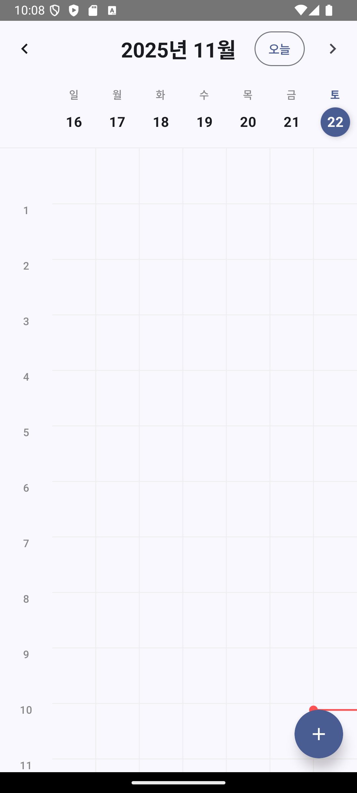
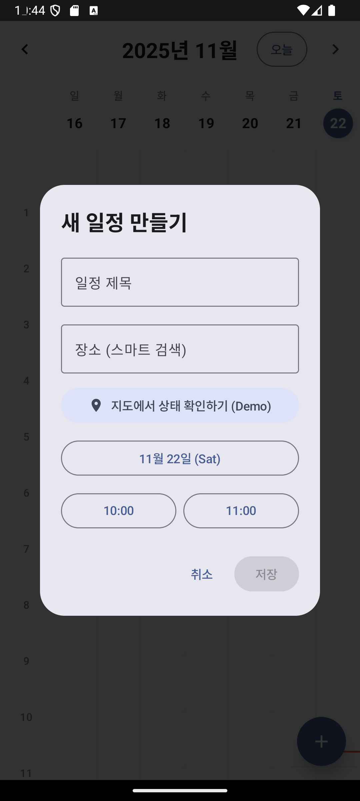
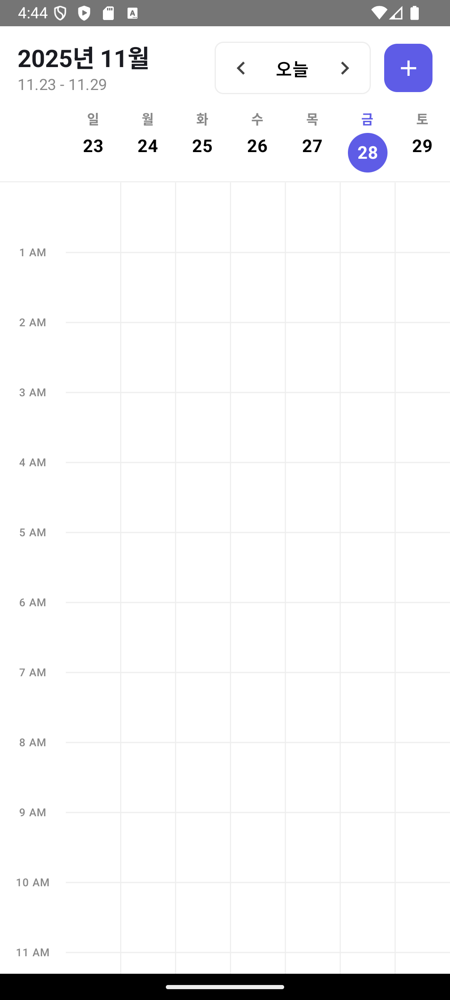
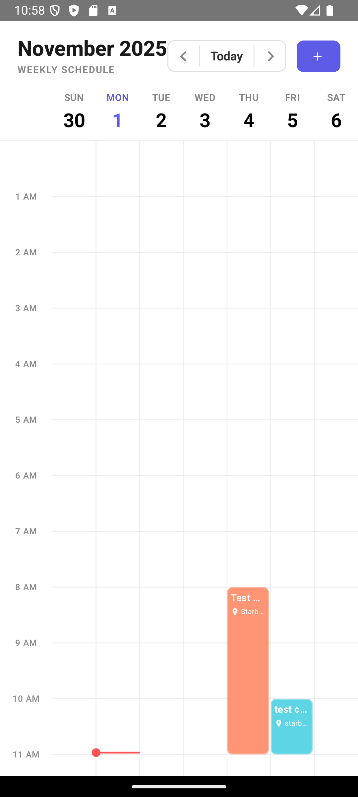
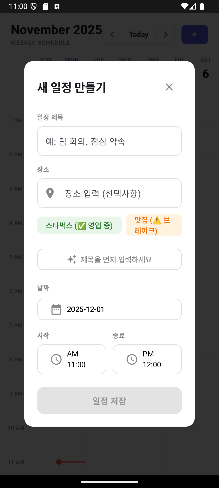

# Mobile Project
## 핵심기능
- 지능형 장소 상태 경고
- 동적 중첩 시각화
- 지도 연동
- Gemini 1.5 flash 기반 스마트 조언
-데이터 영속성 및 안정성

#사용자 인터페이스 및 UI

  
  
  

  
  
  

## 향후 개발 계획
- Jetpack Glance 기반 스마트 위젯
- 접근성 강화
- 라이프스타일 케어
- 탄소 발자국 계산기 및 위라밸 리포트
